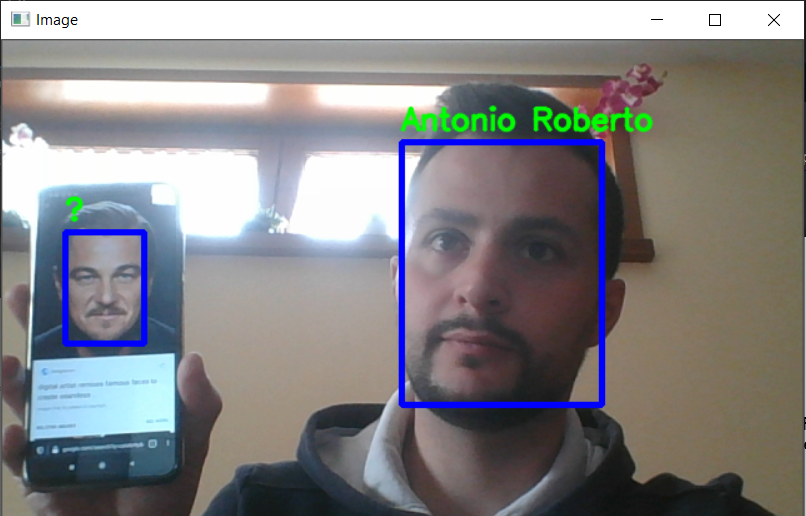

# Open-Set One-Shot Face-Recognition

This repository contains the implementation of a Face Recognition systems working with just ONE image for each face to recognize. The system works in an open-set configuration, it means that it is able to reject not known people.



## Getting started

Execute the following commands to setup you project.

```bash 
git clone https://github.com/robertanto/Open-Set-One-Shot-Face-Recognition.git
cd Open-Set-One-Shot-Face-Recognition
wget https://github.com/robertanto/Open-Set-One-Shot-Face-Recognition/releases/download/final/weights.zip
unzip weights.zip
rm weights.zip
pip3 install -r requirements.txt
```

At this point move your identities pictures in the `face_identies` folder. The images have to be in one of the following extensions: `.jpg`,`.jpeg`,`.png`. The file name will be used as identity ("Bob.jpg -> Bob").


## Compute the face embeddings

This project stores in a pickle file the face embedding of the identities to recognize.

To compute the face embeddings run the following command:
```bash 
python3 ./prep_face_embeddings.py
```

## Demo

To execute the demo run the following command:
```bash 
python3 ./oneshot_face_recognition.py
```